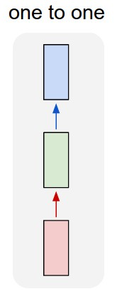
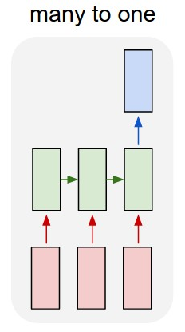
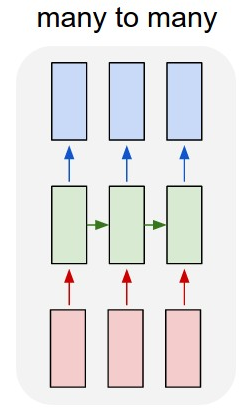

# Understanding the LSTM Input_Shapes and Return_Sequences

A brief definition of the dimension of data, the shapes of LSTM layer and the state of return_sequences parameter is done.

## LSTM one to one

Sequences are not processing. A single time step is used in each input.

  ### Dimension of data
  
    The LSTM expected a 3D array as input
  
      x.train -> 3 - > c(batch_size, timestep = 1, features) 
      y.train -> 2 - > c(batch_size, timestep = 1)

  ### Input_Shape

    input_shape = c(timestep = 1,features)

  ### Example

    - LSTM

        model <- keras_model_sequential() 
        model %>% 
          layer_lstm(units, input_shape, return_sequences = FALSE) %>% 
          layer_dense(units) 

    - Stacked LSTM

        model <- keras_model_sequential() 
        model %>% 
          layer_lstm(units, input_shape, return_sequences = TRUE) %>% 
          layer_lstm(units, return_sequences = FALSE) %>% 
          layer_dense(units) 

## LSTM many to one

The input are sequences (length defined in timestep), the output are single value.

  ### Dimension of data
  
    The LSTM expected a 3D array as input
  
      x.train -> 3 - > c(batch_size, timestep, features) 
      y.train -> 2 - > c(batch_size, timestep)

  ### Input_Shape

    input_shape = c(timestep,features)

  ### Example

    - LSTM

        model <- keras_model_sequential() 
        model %>% 
          layer_lstm(units, input_shape, return_sequences = FALSE) %>% 
          layer_dense(units) 

    - Stacked LSTM

        model <- keras_model_sequential() 
        model %>% 
          layer_lstm(units, input_shape, return_sequences = TRUE) %>% 
          layer_lstm(units, return_sequences = FALSE) %>% 
          layer_dense(units) 

## LSTM many to many

The input and output are sequences (length defined in timestep).

  ### Dimension of data
  
    The LSTM expected a 3D array as input
  
      x.train -> 3 - > c(batch_size, timestep, features) 
      y.train -> 3 - > c(batch_size, timestep, features)

  ### Input_Shape

    input_shape = c(timestep,features)

  ### Example

    - LSTM

        model <- keras_model_sequential() 
        model %>% 
          layer_lstm(units, input_shape, return_sequences = TRUE) %>% 
          layer_dense(units) 

    - Stacked LSTM

        model <- keras_model_sequential() 
        model %>% 
          layer_lstm(units, input_shape, return_sequences = TRUE) %>% 
          layer_lstm(units, return_sequences = TRUE) %>% 
          layer_dense(units) 
